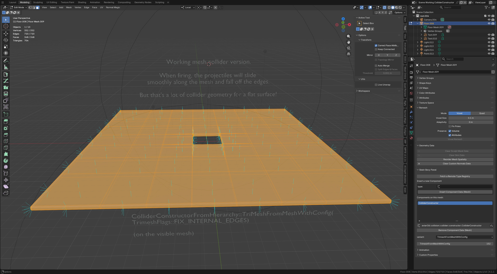
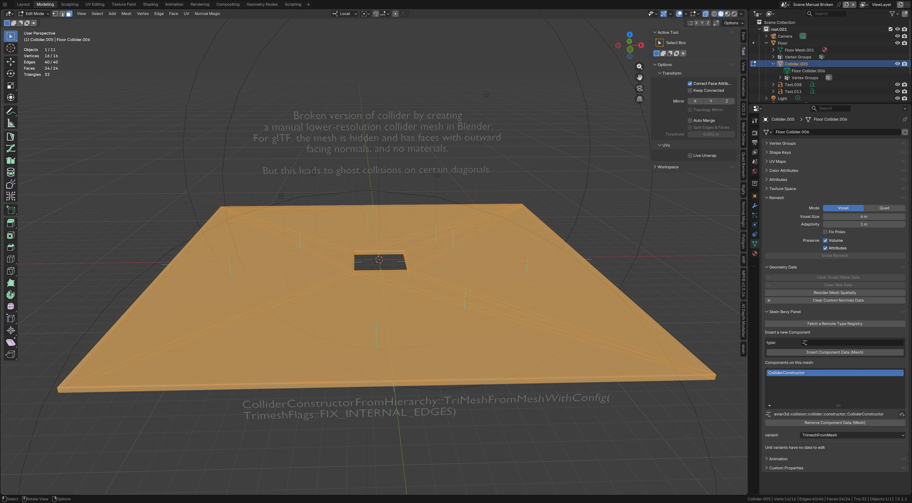
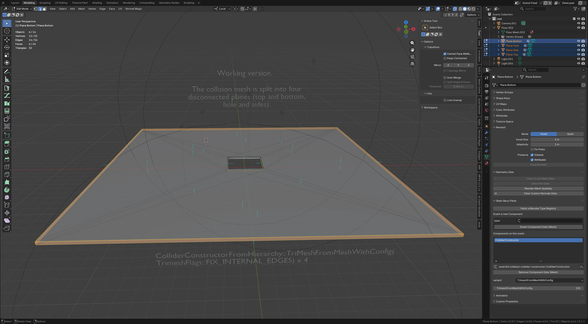

# Ghost edge collisions

(This relates to Bevy 0.18.1 and Avian 0.6 (and 0.7.0-dev as of 2026/06/15), using Parry 0.26.1 under the hood. (I also backported bugfixes from Parry 0.28 to no effect :( )

Maybe the number one question in the Avian channel of the Bevy Discord channel is, "why does this moving object bounce on this flat surface?" And the typical answer is,
"you need to use `ColliderConstructor::TrimeshFromMeshWithFlags(TrimeshFlagS::FIX_INTERNAL_EDGES)`".

That *usually* works but not always!

This contains a test project which cycles through various incarnations of taking a reasonable Blender scene and trying to get reliable collision results.

## Workflow

The basic workflow for me is:

1. Author a level in Blender,
2. Decorate objects and meshes with Skein ([https://bevyskein.dev/])
3. Export these as glTF
4. Import them into a Bevy game at runtime

## Blender view

The original layout:

Due to earlier collision woes I ended up with a high amount of rendered geometry, and later tried to reduce the physics overhead with a simplified custom mesh collider.

After making a nested mesh for the collision geometry:

Interestingly, ghost collisions only occur in some cases. And frustratingly, only in those with the reduced collision geometry. Grr!

I checked and double-checked and triple-checked for classic problems (degenerate geometry, flipped normals, overlapping verts/edges) but none of these are present AFAICT.

The only thing that seemed to work here was splitting each of the four faces of the collider into independent planes:

But this, of course, increases the number of entities and colliders and feels wrong. And it's much harder to automate!

## Test program

This program acts as a slideshow with various Blender scene evolutions with ghost collisions
and a playground for tweaking colliders to test for issues.

The `Friction` for all involved entities is `0.0` to ensure that *only* ghost collisions (or real collisions with the hole) should occur.

On scene load, five projectiles (`Collider::Cuboid`) will be launched from a short Y distance across the plane
where they should all smoothly slide off. (There's one in the middle that intends to hit the hole or its edges.)

<video width="320" height="240" controls>
  <source src="media/playthrough.mp4" type="video/mp4">
</video>

## Usage

* `right arrow` selects the next scene where I tried a new trick. The first is "Working mesh collider version" and the last is "Working version".
* `left arrow` goes back.

* `0` toggles Avian gizmo rendering. I have enabled normal collisions as red lines.
* `Enter` (hold down for more speed) will re-launch projectiles.

These keys regenerate collision geometry on the fly:

* flipped triangles (`f`)
* `TrimeshFlags::default()` (== 0!) (`z`)
* flipped triangles and default flags (`r`)
* using all the TrimeshFlags *except* the secret one driving `FIX_INTERNAL_EDGES` (`q`)
* golden `FIX_INTERNAL_EDGES` workflow (`Backspace`)

* `a` will cycle between rebuilding colliders on meshes only, all objects (including projectiles), and non-mesh objects only.
(You'll need to reload the scene -- `left arrow` + `right arrow` -- to undo the effects of destructively changing the projectile `Cuboid` into a `Trimesh`.)

I find that:

* *good* collision geometry (no ghost collisions) can be made *bad* with the wrong flags.
* *bad* collision geometry can *never* be made *good* with any combination of flags.

I do not know why.

There are keys that add gizmos for aspects of the Parry `Trimesh` that I thought might be relevant:

* `1` turns on vertex normals
* `2` turns on edge normals
* `3` turns on face normals

I can't seem to find anything that directly points to a problem, assuming these have any bearing on the situation at all.

I think I've come far enough along at least to provide this as a useful test case to ensure that new collider algorithms work properly, I hope.
